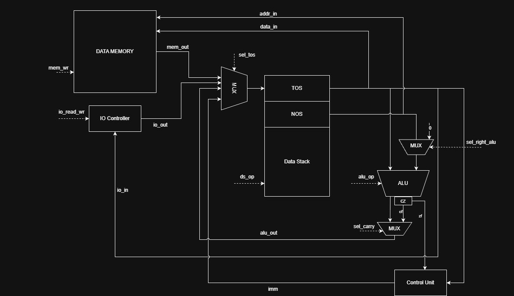
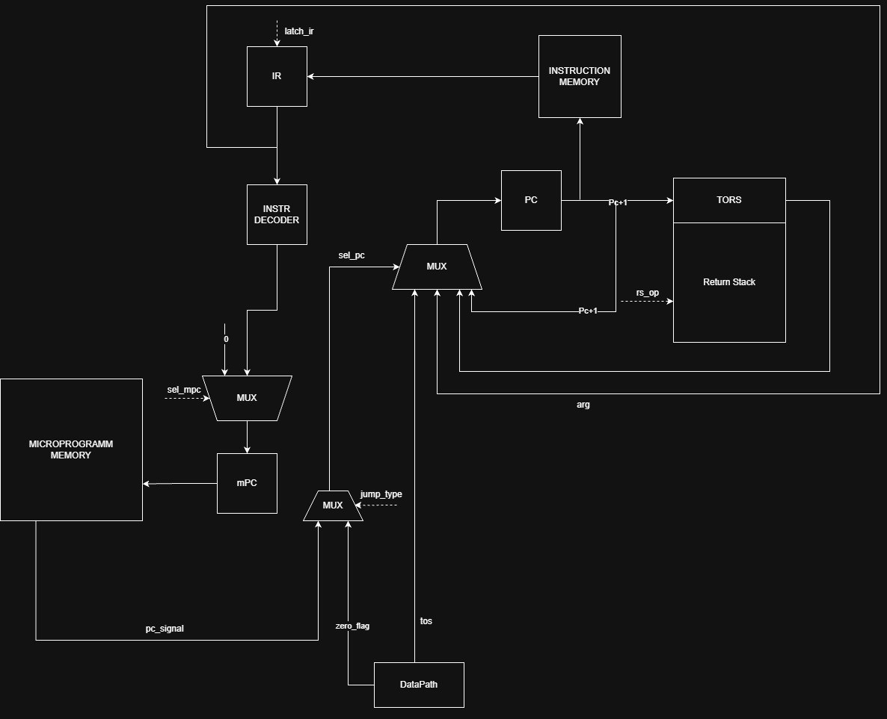

# Лабораторная работа №4

---

- Студент: _Павленко Иван Дмитриевич, P3217, 466985_
- Вариант: `forth | stack | harv | mc | tick | bin | stream | port | pstr | prob2 | vector`
- Усложнение не реализуется.

---

## Оглавление

- [Вариант](#вариант)
- [Язык программирования](#язык-программирования)
  - [Синтаксис (EBNF)](#синтаксис-ebnf)
  - [Семантика](#семантика)
  - [Словарь языка](#словарь-языка)
- [Организация памяти](#организация-памяти)
- [Система команд](#система-команд)
  - [Особенности процессора](#особенности-процессора)
  - [Набор инструкций](#набор-инструкций)
  - [Кодирование инструкций](#кодирование-инструкций)
- [Транслятор](#транслятор)
- [Модель процессора](#модель-процессора)
  - [DataPath](#datapath)
  - [ControlUnit](#controlunit)
  - [Микропрограмма](#микропрограмма)
- [Тестирование](#тестирование)

---

## Язык программирования

Исходный язык -- минимальный Forth-подобный диалект. Программа представляет собой последовательность токенов, исполняемых слева направо. Основная вычислительная модель -- стек данных; большинство слов берут аргументы с вершины стека и кладут результат обратно.

### Синтаксис (EBNF)

```ebnf
program       = { top-level } ;
top-level     = variable-decl | word-decl | statement ;

variable-decl = "variable" , identifier , [ "=" , integer-lit ] ;
word-decl     = ":" , identifier , { statement } , ";" ;

statement     = integer-lit
              | string-lit
              | print-str
              | if-stmt
              | loop-stmt
              | tick
              | word-call ;

integer-lit   = [ "+" | "-" ] , digit , { digit } ;
string-lit    = 's"' , { any-char-except-quote } , '"' ;
print-str     = '."' , { any-char-except-quote } , '"' ;

if-stmt       = "if" , { statement } , [ "else" , { statement } ] , "then" ;
loop-stmt     = "begin" , { statement } , "while" , { statement } , "repeat"
              | "begin" , { statement } , "again"
              | "begin" , { statement } , "until" ;
tick          = "'" , identifier ;
word-call     = identifier ;

identifier    = non-space-char , { non-space-char } ;
digit         = "0" | "1" | … | "9" ;

comment       = "(" , { not-")" } , ")"
              | "\" , { not-newline }
              ;
```

Имена слов и переменных регистронезависимы.

Строковый литерал `s"text"` и оператор печати `." text"` компилируются в статическую Pascal-строку в памяти данных: первое машинное слово хранит длину, следующие слова -- коды символов (один символ = одно слово).

### Семантика

- **Стратегия вычислений** -- строгая, постфиксная. Операнды и результаты передаются через стек данных. Выражение `(2 + 3) * 4` записывается как `2 3 + 4 *`.
- **Области видимости** -- единая глобальная таблица символов: встроенные слова, `:`-определения, `variable`-имена. Локальных переменных нет.
- **Литералы**: целое -- `PUSH imm` (24-битное signed); `." …"` -- pstr в памяти данных + `CALL __emit_str__`; `s" …"` -- pstr + `PUSH addr`.
- **Переменные** -- `variable x` резервирует ячейку в памяти данных; опционально `variable x = N` задаёт начальное значение. Обращение к `x` кладёт адрес на стек; `x load` -- чтение, `val x store` -- запись.
- **Буферы** -- `variable buf 15 alloc` резервирует 15 последовательных ячеек данных, начиная с адреса `buf`.
- **Ввод-вывод** -- `<port> in` читает токен с порта, `<val> <port> out` пишет токен в порт. Порт `0` -- stdin, порт `1` -- stdout.
- **Execution token** -- `'` кладёт адрес слова на стек, `execute` выполняет слово по этому адресу.


Управление потоком:

- `if … else … then` -- снимает флаг со стека; `0` -- ложь, любое ненулевое -- истина.
- `begin … until` -- повторяет тело, пока флаг на вершине стека равен нулю.
- `begin … again` -- бесконечный цикл (`JMP begin`); остановка -- по EOF на вводе.
- `begin … while … repeat` -- продолжает, пока флаг истинен; при ложном значении выходит.

### Словарь языка
| Слово | Стековый комментарий | Назначение |
| --- | --- | --- |
| `+` `-` `*` `/` `mod` | `( a b -- r )` | Арифметика над двумя верхними значениями |
| `=` `<` `>` | `( a b -- flag )` | Сравнения, `flag` ∈ {0, 1} |
| `dup` / `drop` / `swap` / `over` | `( … -- … )` | Манипуляции со стеком данных |
| `<число>` | `( -- n )` | Положить целый литерал на стек |
| `variable name [= v]` | -- | Объявить переменную (нач. значение `v`, по умолчанию 0) |
| `<n> alloc` | -- | Зарезервировать `n` ячеек данных (буферы) |
| `name` (переменная) | `( -- addr )` | Положить адрес ячейки |
| `load` / `store` | `( addr -- v )` / `( v addr -- )` | Чтение / запись `data_mem` |
| `<port> in` / `<v> <port> out` | `( -- v )` / `( v -- )` | Ввод-вывод через порт |
| `." …"` / `s" …"` | `( -- )` / `( -- addr )` | Печать строки / адрес pstr-литерала |
| `carry` | `( -- c )` | Флаг переноса `C` последней АЛУ-операции |
| `: name … ;` / `name` | -- / по телу | Определить слово / вызвать его |
| `' name` / `execute` | `( -- xt )` / `( xt -- )` | Execution token и косвенный вызов |
| `if … else … then` | `( flag -- )` | Ветвление (0 -- ложь) |
| `begin … while … repeat` / `begin … again` / `begin … until` | -- | Циклы |
---

## Организация памяти

Гарвардская архитектура. Машинное слово -- **32 бита**, big-endian.

```text
        Instruction Memory                  Data Memory
        ──────────────────            ─────────────────────────────
   0x0  │ инструкция      │      0x0  │ variable cell #0          │
   0x1  │ инструкция      │      0x1  │ variable cell #1          │
        │ ...             │           │ ...                       │
        │ <user words>    │      0xV  │ pstr literal #0: len      │
        │ __emit_str__    │      0xV+1│ pstr literal #0: ch0      │
        └─────────────────┘           └───────────────────────────┘
```

Регистров общего назначения нет.

Транслятор ведёт единый счётчик `data_ptr`: переменные, строки и буферы `alloc` получают адреса в порядке объявления в исходнике. После загрузки модели память данных инициализируется нулями; транслятор записывает в неё начальные значения переменных и тела pstr-литералов.

---

## Система команд

### Особенности процессора

- **Тип данных**: 32-битное знаковое целое.
- **Регистры/стеки**: два стека (данных и возвратов), без регистров общего назначения.
- **Адресация памяти данных** -- прямая абсолютная по адресу с вершины стека (`LOAD` / `STORE`).
- **Поток управления** -- `JMP`, `JZ`, `CALL`, `RET`, `EXECUTE`, `HALT`.
- **I/O** -- port-mapped: Порт 0 -- stdin, порт 1 -- stdout.
- **Прерываний нет**.

Классификация: **Stack ISA**, фиксированная длина слова. Все инструкции исполняются за **2 такта**: 1 такт fetch + 1 такт execute.

### Набор инструкций

| Opcode | Hex | Мнемоника | Стековый комментарий | Описание |
| ---:| ---:| --- | --- | --- |
| 0 | `0x00` | `PUSH imm` | `( -- imm )` | Положить 24-битное signed immediate на стек |
| 1 | `0x01` | `DUP` | `( a -- a a )` | Дублировать TOS |
| 2 | `0x02` | `DROP` | `( a -- )` | Снять TOS |
| 3 | `0x03` | `SWAP` | `( a b -- b a )` | Поменять TOS и NOS |
| 4 | `0x04` | `OVER` | `( a b -- a b a )` | Скопировать NOS на вершину |
| 5 | `0x05` | `ADD` | `( a b -- a+b )` | Сложение |
| 6 | `0x06` | `SUB` | `( a b -- a-b )` | Вычитание (NOS − TOS) |
| 7 | `0x07` | `MUL` | `( a b -- a*b )` | Умножение |
| 8 | `0x08` | `DIV` | `( a b -- a/b )` | Целочисленное деление |
| 9 | `0x09` | `MOD` | `( a b -- a mod b )` | Остаток от деления |
| 10 | `0x0A` | `EQ` | `( a b -- a==b )` | Равенство: 1 если равны, 0 иначе |
| 11 | `0x0B` | `LT` | `( a b -- a<b )` | Меньше |
| 12 | `0x0C` | `GT` | `( a b -- a>b )` | Больше |
| 13 | `0x0D` | `LOAD` | `( addr -- val )` | Прочитать `data_mem[addr]` |
| 14 | `0x0E` | `STORE` | `( val addr -- )` | Записать `val` в `data_mem[addr]` |
| 15 | `0x0F` | `JMP addr` | `( -- )` | Безусловный переход |
| 16 | `0x10` | `JZ addr` | `( flag -- )` | Переход если `flag == 0` |
| 17 | `0x11` | `CALL addr` | RS: `( -- PC+1 )` | Сохранить `PC+1` в RS, перейти на `addr` |
| 18 | `0x12` | `RET` | RS: `( ra -- )` | Восстановить PC из RS |
| 19 | `0x13` | `EXECUTE` | `( addr -- )`; RS: `( -- PC+1 )` | Pop addr, CALL по нему |
| 20 | `0x14` | `IN port` | `( -- val )` | Прочитать токен с порта |
| 21 | `0x15` | `OUT port` | `( val -- )` | Записать val в порт |
| 22 | `0x16` | `HALT` | `( -- )` | Остановить моделирование |
| 23 | `0x17` | `CARRY` | `( -- c )` | Положить carry-флаг последней АЛУ-операции на стек |

### Кодирование инструкций

```text
 31        24 23                                              0
┌────────────┬───────────────────────────────────────────────┐
│   opcode   │             immediate / address               │
│   8 бит    │             24 бита, знаковое целое           │
└────────────┴───────────────────────────────────────────────┘
```

Immediate используется только в `PUSH`, `JMP`, `JZ`, `CALL`, `IN`, `OUT`. В остальных опкодах биты 23..0 -- нули.

Бинарный файл (`.bin`):

```text
offset  size  поле
─────── ───── ────────────────────────────────────────
0       4     code_len     (big-endian)
4       4     data_len     (big-endian)
8       4·C   code section (big-endian)
8+4·C   4·D   data section (big-endian, signed)
```

Текстовый дамп (`.bin.hex`) -- формат строки: `<address> - <HEXCODE> - <mnemonic>`, секции разделены заголовками `; CODE SECTION` / `; DATA SECTION`.

---

## Транслятор

Интерфейс командной строки: `python src/translator.py <input.forth> <output.bin>`

Создаёт два файла: `<output.bin>` и `<output.bin>.hex`.

Реализован в модуле: [src/translator.py](src/translator.py).

Этапы трансляции:

1. **Лексер** -- разбивает текст на токены `Token(kind, value, line, col)`. Отбрасывает комментарии `( … )` и `\ …`. Строки `." …"` / `s" …"` сохраняются как единые токены.
2. **Первый проход** -- собирает: `variable name` → адрес в памяти данных; `: name … ;` → адрес слова в памяти команд; остаток → тело `main`. Конфликты имён → `CompileError`.
3. **Кодоген** -- генерирует top-level + `HALT`, затем тела user-words + `RET`. Если использован `."` -- добавляет `__emit_str__` helper. Forward-references на адреса слов патчатся после генерации всего кода.
4. **Сериализация** -- `pack_program(code, data)` собирает бинарный файл; `to_hex_dump` -- текстовый дамп.

Отображение управляющих конструкций:

```forth
if  …  then                  =  JZ end ; … ; end:
if  …  else  …  then         =  JZ else ; … ; JMP end ; else: … ; end:
begin … until                =  begin: … ; JZ begin
begin … again                =  begin: … ; JMP begin
begin … while … repeat       =  begin: … ; JZ end ; … ; JMP begin ; end:
```

Пример трансляции. Исходник:

```forth
: square  dup *  ;

variable x = 6

x load square x store
```

Дамп `.bin.hex`: слово `square` -- отдельная процедура по адресу 6; переменная `x` -- ячейка данных 0 с начальным значением 6; top-level завершается `HALT`:

```text
; CODE SECTION
0 - 00000000 - PUSH 0      ; адрес x
1 - 0D000000 - LOAD        ; x load
2 - 11000006 - CALL 6      ; square
3 - 00000000 - PUSH 0      ; адрес x
4 - 0E000000 - STORE       ; x store
5 - 16000000 - HALT
6 - 01000000 - DUP         ; : square
7 - 07000000 - MUL
8 - 12000000 - RET         ; ;

; DATA SECTION
0 - 00000006 - 6           ; x = 6
```

---

## Модель процессора

Интерфейс командной строки: `python src/machine.py <code.bin> [<input.txt>] [--limit N] [--log {debug|info|warning|off}]`

Реализована в модуле: [src/machine.py](src/machine.py).

### DataPath



Стек данных -- регистры **TOS** и **NOS** плюс остальная память. Защёлки обновляются синхронно в конце такта.

Реализован в классе `DataPath`.

Сигналы (обрабатываются за один такт):

- `sel_tos` -- мультиплексор источника TODS: MEM / IO / ALU / IMM
- `sel_carry` -- мультиплексор после АЛУ: `False` = result, `True` = c_flag
- `sel_right_alu` -- правый вход АЛУ: NEXT (NOS) / ZERO (0); левый вход -- всегда TODS
- `alu_op` -- операция АЛУ: NOP / ADD / SUB / MUL / DIV / MOD / EQ / LT / GT
- `ds_op` -- операция со стеком данных: NOP / PUSH / LATCH_TODS / ALU_TO_TODS / DROP / DROP2 / DUP / SWAP / OVER
- `mem_read` / `mem_write` -- чтение/запись `data_mem[TODS]`
- `io_read` / `io_write` -- IN/OUT через порты

Флаги:

- `zero` -- результат нуля на алу.
- `carry` -- беззнаковое переполнение, защёлкивается в `c_flag` и доступен через опкод `CARRY`

### ControlUnit



Реализован в классе `ControlUnit`.

Сигналы:
- `sel_pc` -- источник PC: KEEP / INC / TODS / TORS
- `jump_type` -- тип перехода: NONE / UNCOND / COND_ZERO.
- `sel_mpc` -- источник mPC: FETCH / DISPATCH (каждая инструкция = FETCH + 1 exec-такт)
- `rs_op` -- операция со стеком возвратов: NOP / PUSH_PC_PLUS_1 / POP
- `latch_ir` -- защёлкнуть IR из памяти команд
- `halt` -- остановить моделирование

### Микропрограмма

Память микропрограмм -- 25 ячеек. Адрес 0 -- FETCH; адреса 1..24 -- execute (по одному такту на опкод). Итого **2 такта на инструкцию**.

Реализована в модуле: [src/microcode.py](src/microcode.py).

| μPC | Лейбл | alu_op | ds_op | sel_tos | sel_carry | mem | io | sel_pc | sel_mpc | прочее |
| ---:| --- | --- | --- | --- | --- | --- | --- | --- | --- | --- |
| 0 | FETCH | -- | -- | -- | -- | -- | -- | KEEP | DISPATCH | latch_ir |
| 1 | EXEC_PUSH | -- | PUSH | IMM | -- | -- | -- | INC | FETCH | |
| 2 | EXEC_DUP | -- | DUP | -- | -- | -- | -- | INC | FETCH | |
| 3 | EXEC_DROP | -- | DROP | -- | -- | -- | -- | INC | FETCH | |
| 4 | EXEC_SWAP | -- | SWAP | -- | -- | -- | -- | INC | FETCH | |
| 5 | EXEC_OVER | -- | OVER | -- | -- | -- | -- | INC | FETCH | |
| 6..13 | EXEC_ADD..GT | op | ALU_TO_TODS | -- | -- | -- | -- | INC | FETCH | |
| 14 | EXEC_LOAD | -- | LATCH_TODS | MEM | -- | read | -- | INC | FETCH | |
| 15 | EXEC_STORE | -- | DROP2 | -- | -- | write | -- | INC | FETCH | |
| 16 | EXEC_JMP | -- | -- | -- | -- | -- | -- | -- | FETCH | jump_type=UNCOND |
| 17 | EXEC_JZ | ADD | DROP | -- | -- | -- | -- | -- | FETCH | sel_right_alu=ZERO; jump_type=COND_ZERO |
| 18 | EXEC_CALL | -- | -- | -- | -- | -- | -- | -- | FETCH | jump_type=UNCOND; rs_push |
| 19 | EXEC_RET | -- | -- | -- | -- | -- | -- | TORS | FETCH | rs_pop |
| 20 | EXEC_EXECUTE | -- | DROP | -- | -- | -- | -- | TODS | FETCH | rs_push |
| 21 | EXEC_IN | -- | PUSH | IO | -- | -- | read | INC | FETCH | |
| 22 | EXEC_OUT | -- | DROP | -- | -- | -- | write | INC | FETCH | |
| 23 | EXEC_HALT | -- | -- | -- | -- | -- | -- | KEEP | KEEP | halt |
| 24 | EXEC_CARRY | -- | PUSH | ALU | **True** | -- | -- | INC | FETCH | push c_flag |

Декодер `DISPATCH` по опкоду из `IR` выбирает адрес первой микроинструкции execute; `mPC` идёт последовательно до возврата в FETCH.

---

## Тестирование

Тестирование выполняется при помощи golden-тестов, реализовано в: [src/golden_test.py](src/golden_test.py).
Конфигурации (`src/golden/`):

| Golden | Алгоритм | Что проверяет |
| --- | --- | --- |
| [hello.yml](src/golden/hello.yml) | hello | `pstr`-литералы, `."`, `__emit_str__`, `begin/while/repeat` |
| [cat.yml](src/golden/cat.yml) | cat | `begin/again`, port I/O, остановка по EOF |
| [hello_user_name.yml](src/golden/hello_user_name.yml) | hello_user_name | Чтение имени, приветствие, потоковый ввод-вывод |
| [sort.yml](src/golden/sort.yml) | sort | Сортировка выбором; буфер через `variable buf 15 alloc`, `load`/`store` |
| [double_arith.yml](src/golden/double_arith.yml) | арифметика двойной точности | 64-битное сложение; carry-флаг после ADD для переноса между словами |
| [euler6.yml](src/golden/euler6.yml) | **alg2** | Project Euler #6 |
| [exec_token.yml](src/golden/exec_token.yml) | демо `'`/`execute` | Execution token |
| [pstr_demo.yml](src/golden/pstr_demo.yml) | демо `pstr` | Pascal-строки |
| [harvard_demo.yml](src/golden/harvard_demo.yml) | демо Harvard | Раздельность памяти команд и данных |
| [variables_demo.yml](src/golden/variables_demo.yml) | демо `variable` | `variable name = value` + `load`/`store` |

Запустить тесты:

```shell
cd src && python -m pytest -v
```

Обновить эталоны:

```shell
cd src && python -m pytest -v --update-goldens
```

Пример журнала процессора (`--log debug`):

```text
TICK=   4  mPC=21(EXEC_IN     )  PC=  2→3    IR=IN 0       TODS=104('h')  NEXT=·       TORS=1    Z   ds=1 rs=1   IN[0]=104('h')

### CI

Настройка CI находится в файле [.github/workflows/python.yaml](.github/workflows/python.yaml).

В CI выполняются следующие проверки:

- `python -m pytest -v` -- golden-тесты транслятора и модели процессора
- `ruff format --check .` -- проверка форматирования кода
- `ruff check .` -- проверка кода линтером


Если хотя бы одна проверка завершается ошибкой, CI считается непройденным.
